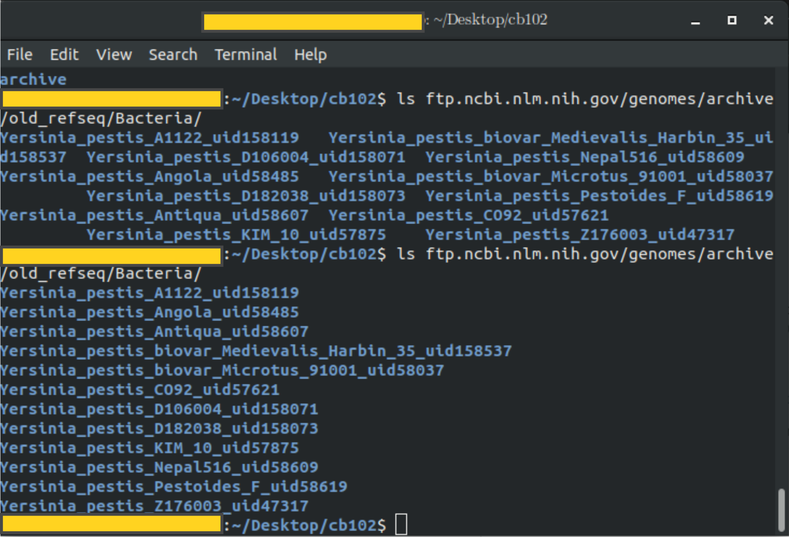

# Problem #1

## Approach

In order to determine how many `unique domains` were found in the 9609.tsv within a single bash pipeline, I started by calling the `tail` command with the `-n+4` option to remove the descriptive information at the beginning of the file. This then was piped to the `cut` command with the fields option set to 7. This returns only the 7th column, which was the column containing the domain information for each line. These domains were then `sort`ed to so that the `uniq` command could remove duplicates. Finally, this list of unique domain types was piped into the `wc` with the line option to count the number of lines. 

## Code

	tail -n+4 9606.tsv | cut -f 7 | sort | uniq | wc -l

## Solution

**6512 unique domain types** found in the 9606.tsv file.

# Problem #2

In order to download all of the *Yersinia pestis* genomes found in `ftp://ftp.ncbi.nlm.nih.gov/genomes/archive/old_refseq/Bacteria/Yersinia_pestis`, I realizes I'd need a wildcard. A cursory Google search found [this](https://unix.stackexchange.com/questions/117988/wget-with-wildcards-in-http-downloads) site which suggested using the recursive (`-r`) and accept list (`-A`) options. By including the `-nH` and `--cut-dirs=4`, I was able to skip the generating the defualt directory tree. Using these options, I generated a single line bash command that downloaded all of the *Yersinia pestis* genomes.

## Code

	`wget -r --no-parent -A '*.faa' -nH --cut-dirs=4 ftp://ftp.ncbi.nlm.nih.gov/genomes/archive/old_refseq/Bacteria/Yersinia_pestis*`

## Solution

Running an `ls` on the resulting download produced a list of 12 directories pulled from the website (**Figure 1**).

# Problem #3

## Approach

In order to find the `total number of proteins in all the *Yersinia pestis* strains` from within the last directory, I chose to use the `find` command with the starting directory being `../` and the target `-name` pattern being `*.faa`. This generates a list of all the paths to all the protein lists that were downloaded in problem #2. Using the `-exec cat {} \;` command then allows me to pipe this completely concatenated file into a `grep ">"` command to generate only the lines containing the protein identifier lines. This could then be piped into a `wc -l` command resulting in the total number of genes amongst all the *Yersinia pestis* strains available.

## Code

  `find ../ -name "*faa" -exec cat {} \; | grep ">" | wc -l`
  
## Solution 

In total, **48772** genes were found within the 43 files downloaded. Undoubtably many of these are duplicates, especially considering that each of the 12 strains had multiple files associated with them.

# Problem #4a

## Approach

To find out the average protein length for this particular strain, I generated two variables:

  1) The total number of amino acids within the strain. This was determined by pulling all the lines without ">", removing the newline code, and then counting the characters.
  2) The total number of sequences. This was determined by using `grep` and `wc -l` count the number of lines that **did** contain a ">".
  
These two variables were then echoed into a `bc` command such that it would divide the total number of amino acids by the total number of proteins

## Code

  `echo $(cat NC_000913.faa | grep -v ">" | tr -d "\n" | wc -c)/$(cat NC_000913.faa | grep ">" | wc -l) | bc`

## Solution

The average length of an protein in this particular strain of *E. coli* was **316 amino acids**.

# Problem #4b

## Approach

Having determine the shellcode required to get the average amino acid length of an incoming *.faa* file, it only needed to be copy and pasted into a *.sh* file with the `#!/bin/bash` included on the first line to run in the bash. Additionally, the filename in the 4a code was replaced with `$1` to make it generalizable and a custom output was written to make it more user-friendly. The permissions of the file was also changed to be executable through using `chmod 775`.

## Code

  `#!/bin/bash`
  
  `export x=$(echo $(cat $1 | grep -v ">" | tr -d "\n" | wc -c)/$(cat NC_000913.faa | grep ">" | wc -l) | bc)`
  
  `echo "The average amino acid length of proteins found in "$1" is "$x"."`

## Solution

Testing the script on the file from 4a produced the same results by calling:

  `bash hmw1_4b.sh NC_000913.faa`
  
The script has also been included along with this file as "hmw1_4b.sh".
